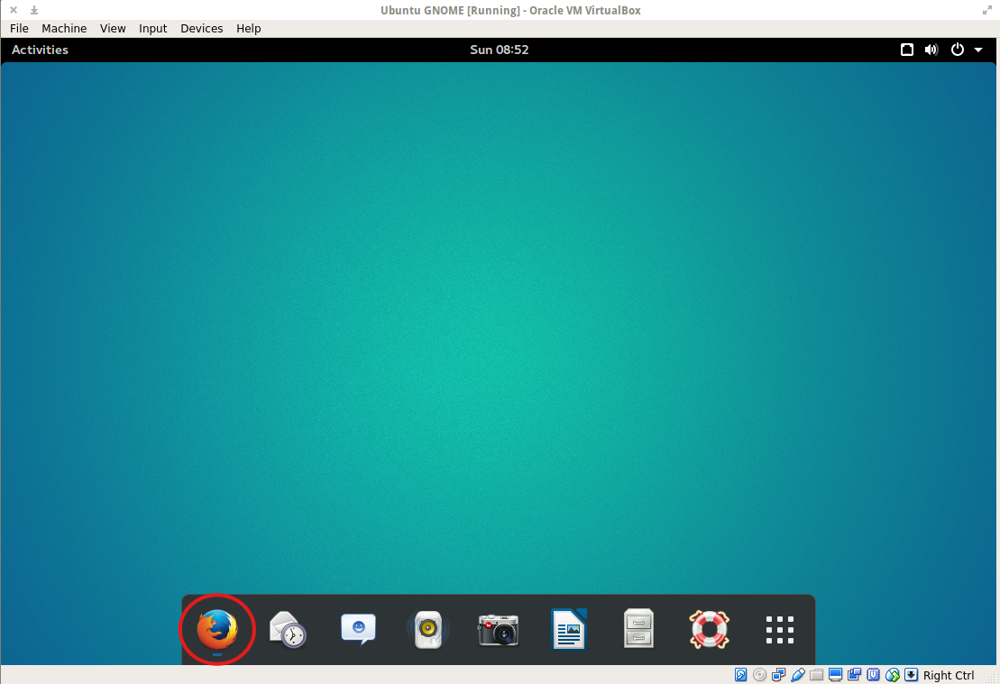
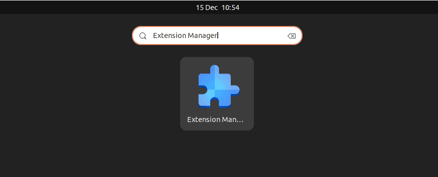
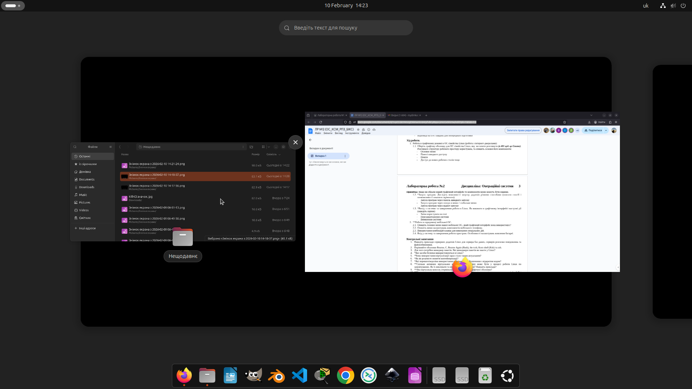
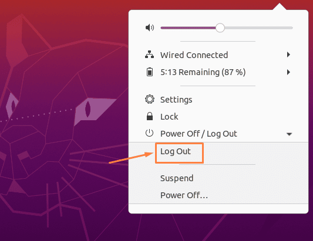

# Лабораторна робота №2
## Дисципліна: Операційні системи
## Тема: “Знайомство з інтерфейсом та можливостями ОС Linux”
### Виконав: студент групи РПЗ-33, Лоботенко Дмитро

---

### Мета роботи:
1. Знайомство з інтерфейсами ОС Linux.  
2. Отримання практичних навиків роботи в середовищах ОС Linux та мобільної ОС – їх графічною оболонкою, входом і виходом з системи, ознайомлення зі структурою робочого столу, вивчення основних дій та налаштувань при роботі в системі.

### Матеріальне забезпечення занять:  
1. ЕОМ типу IBM PC.  
2. ОС сімейства Windows та віртуальна машина Virtual Box (Oracle).  
3. ОС GNU/Linux (будь-який дистрибутив).  
4. Сайт мережевої академії Cisco netacad.com та його онлайн курси по Linux.

### Завдання для попередньої підготовки.   
**1.** ***Прочитайте короткі теоретичні відомості до лабораторної роботи та зробіть невеликий словник базових англійських термінів з питань призначення команд та їх параметрів.**

_Словник базових англійських термінів_

| № | Слово | Пояснення |
| :--- | :--- | :--- |
| 1 | **Command Line Interface (CLI)** | Інтерфейс командного рядка; спосіб взаємодії з комп'ютером за допомогою введення текстових команд |  
| 2 | **Kernel** | Ядро; головний компонент операційної системи, який безпосередньо керує "залізом" та процесами |  
| 3 | **Process** | Процес; програма, яка в даний момент виконується і якій виділені ресурси пам'яті |  
| 4 | **Multitasking** | Багатозадачність; властивість ОС одночасно (або псевдо-одночасно) виконувати кілька процесів |  
| 5 | **Desktop Application** | Десктопний застосунок; програма з графічним інтерфейсом, призначена для прямої взаємодії з користувачем |  
| 6 | **Server Application** | Серверний застосунок; програма, що працює у фоновому режимі та обробляє запити від інших клієнтів у мережі |  
| 7 | **Compiler** | Компілятор; спеціальна програма, яка перекладає зрозумілий людині вихідний код у машинні інструкції |  
| 8 | **Resource Allocation** | Розподіл ресурсів; процес керування доступом програм до процесора, оперативної пам'яті та диска |  
| 9 | **Terminal / X-term** | Термінал; графічне вікно-емулятор, яке дозволяє користувачеві працювати з командним рядком у графічній оболонці |  
| 10 | **Source Code** | Вихідний код; набір інструкцій програми, написаний певною мовою програмування |  
| 11 | **Application Programming Interface (API)** | Програмний інтерфейс; набір готових функцій та правил, за допомогою яких програми спілкуються з ядром ОС |  
| 12 | **Network File Share** | Мережевий диск/ресурс; технологія, що дозволяє отримувати доступ до файлів на віддаленому сервері так, ніби вони знаходяться на локальному ПК |  

**2. Вивчіть матеріали онлайн-курсу академії Cisco “NDG Linux Essentials”:**

&nbsp;&nbsp;&nbsp;- Chapter 3 - Working in Linux  
&nbsp;&nbsp;&nbsp;- Chapter 4 - Open Source Software and Licensing

**3. Пройдіть тестування у курсі NDG Linux Essentials за такими темами:**

&nbsp;&nbsp;&nbsp;- Chapter 03 Exam  
&nbsp;&nbsp;&nbsp;- Chapter 04 Exam  

 
  
**4.** ****Дайте визначення наступним поняттям:**

&nbsp;&nbsp;&nbsp;- CLI-режим  

<blockquote>
  
**CLI-режим (Command Line Interface)** — це текстовий інтерфейс користувача. На відміну від звичних вікон та іконок, тут спілкування з операційною системою відбувається виключно через клавіатуру. Користувач вводить певні команди, система їх обробляє та виводить текстовий результат на екран. Це дуже потужний інструмент для автоматизації рутинних задач та глибокого адміністрування.

</blockquote>

&nbsp;&nbsp;&nbsp;- Термінал на основі графічного інтерфейсу користувача 

<blockquote>
  
**Термінал на основі GUI** — це програма-емулятор (наприклад, GNOME Terminal або Konsole), яка запускається як звичайне вікно всередині графічного середовища (робочого столу). Вона дозволяє мати доступ до командного рядка (CLI) не виходячи з графічної оболонки, що дає змогу паралельно працювати з браузером, редактором коду та консоллю.
  
</blockquote>

&nbsp;&nbsp;&nbsp;- Віртуальний термінал

<blockquote>

**Віртуальний термінал (Virtual Terminal)** — це повноцінний текстовий сеанс, який запускається безпосередньо поверх ядра, минаючи графічну оболонку. У Linux завжди працює кілька таких терміналів (доступних за шорткатами Ctrl+Alt+F1...F6). Вони вкрай корисні для порятунку системи, якщо графічний інтерфейс завис або не завантажується, оскільки дозволяють залогінитись у текстовому режимі та усунути проблему.

</blockquote>

## Хід роботи

**1. Робота в графічному режимі в ОС сімейства Linux (робота з інтернет-джерелами):**

<blockquote>
  
**1.1. Оберіть графічну оболонку для ОС сімейства Linux, яку  ви хочете розглянути (в 401 ауд. це Gnome). Розгляньте структуру робочого пространства користувача, та опишіть основні його компоненти:** 

&nbsp;&nbsp;&nbsp;**- Основне меню** <blockquote>
  
У GNOME головне меню (меню додатків) відкривається за допомогою спеціальної кнопки у вигляді сітки на панелі Dash (або свайпом вгору на трекпаді). Воно виводить на екран сітку з іконками всіх встановлених програм. Користувач може групувати їх у папки для зручності. Меню інтерактивне: варто почати вводити текст, і система одразу відфільтрує список програм за назвою.

</blockquote>
  
&nbsp;&nbsp;&nbsp;**- Панелі швидкого доступу**

<blockquote>
  
Панель швидкого доступу (Dash) з'являється при виклику режиму огляду (Activities). Це аналог док-панелі або панелі завдань. На ній можна закріплювати застосунки, які потрібні постійно (браузер, файловий менеджер, термінал), а також там відображаються іконки тих програм, які відкриті в поточний момент роботи.

</blockquote>

&nbsp;&nbsp;&nbsp;**- Пошук**

<blockquote>
  
Пошукова система у GNOME дуже глибоко інтегрована в оболонку. Її не потрібно відкривати окремо — достатньо натиснути кнопку Super (Windows) і почати друкувати. Пошук індексує не лише встановлені програми, але й файли користувача, налаштування системи (наприклад, пошук мережі чи Bluetooth) і навіть контакти.

</blockquote>

&nbsp;&nbsp;&nbsp;**- Доступ до нових робочих столів**

<blockquote>
  
Керування робочими столами (Workspaces) знаходиться у режимі Activities (зазвичай це горизонтальна стрічка мініатюр під пошуковим рядком або збоку). Особливість GNOME у тому, що робочі столи створюються динамічно: щойно ви розміщуєте вікно на порожньому столі, система автоматично додає ще один пустий стіл праворуч. Це ідеально для організації складних проєктів.

</blockquote>

&nbsp;&nbsp;&nbsp;**- Верхня панель**

<blockquote>
  
Верхня (статусна) панель є постійно видимою. Зліва розташована кнопка "Діяльності" (Activities) та меню поточної активної програми. По центру — віджет годинника з календарем і списком сповіщень. А праворуч розміщено агреговане системне меню, де зібрані перемикачі Wi-Fi, Bluetooth, повзунки гучності/яскравості та кнопки керування живленням.

</blockquote>

&nbsp;&nbsp;&nbsp;**- Огляд діяльності**

<blockquote>
  
"Огляд діяльності" (Activities Overview) — це центральна філософія GNOME. Викликається натисканням відповідної кнопки або клавіші Super. У цьому режимі екран трохи віддаляється, показуючи всі відкриті вікна у вигляді акуратних мініатюр, панель Dash та мініатюри робочих столів. Це дозволяє миттєво оцінити загальний стан системи та перемикатися між задачами.

</blockquote>

 

**1.2.** ***Запуск програм. Дослідіть можливості запуску додатків різними способами (описати спосіб і по-можливості показати скріншоти):**

&nbsp;&nbsp;&nbsp;**- Запуск програм через панель швидкого запуску**

<blockquote>

На ілюстрації продемонстровано найпростіший метод запуску — клік лівою кнопкою миші по іконці закріпленої програми на панелі Dash (панель швидкого доступу). У цьому прикладі курсор миші знаходиться над іконкою веббраузера. Програми, які вже активні, мають невеличку позначку (зазвичай крапочку) біля своєї іконки. Щоб додати сюди нову програму, достатньо знайти її в загальному меню, клікнути правою кнопкою миші та вибрати опцію "Додати до обраного".

</blockquote>

&nbsp;&nbsp;&nbsp;**- Запуск програм через пошук в меню / глобальне меню**

<blockquote>

На скріншоті показано роботу глобального системного пошуку. Це найефективніший спосіб відкрити програму, якої немає на панелі Dash. Замість того, щоб скролити сторінки іконок, користувач натиснув клавішу Super і ввів частину слова. Інтерфейс миттєво виділив релевантні результати: саму програму, пов'язані з нею утиліти та навіть налаштування системи, які відповідають цьому ключовому слову. Залишається лише натиснути Enter для запуску першого запропонованого варіанту.

</blockquote>

&nbsp;&nbsp;&nbsp;**- Запуск програм через віджет запуску**

<blockquote>

На зображенні представлений режим "Огляду діяльності" (Activities Overview). Це зручний простір не тільки для запуску нових додатків із нижньої док-панелі, а й для навігації між уже відкритими програмами. Усі активні вікна пропорційно зменшуються і розміщуються на екрані так, щоб їх було чітко видно. Клік по будь-якій мініатюрі миттєво переносить фокус на цю програму, повертаючи користувача до звичного робочого режиму.
  
</blockquote>

**1.3.** ***Вихід з системи та завершення роботи в Linux. Як виконати в графічному інтерфейсі наступні дії (наведіть скріни):**

&nbsp;&nbsp;&nbsp;**- Зміна користувача на root**

<blockquote>

На скріншоті видно меню системних налаштувань, відкрите у правому верхньому куті. Щоб авторизуватися під обліковим записом root, спочатку необхідно вийти з поточного профілю. Для цього вибираємо опцію «Завершити сеанс» (Log Out). Після підтвердження система перекине нас на екран дисплей-менеджера. Там потрібно вибрати пункт ручного введення логіна (зазвичай «Не в списку?»), ввести `root` і відповідний пароль. Варто зазначити, що у багатьох дистрибутивах прямий графічний логін для root заблокований за замовчуванням задля безпеки.
  
</blockquote>

&nbsp;&nbsp;&nbsp;**- Перезавантаження системи**

<blockquote>

Щоб відправити комп'ютер у перезавантаження через графічний інтерфейс, ми знову звертаємося до системного меню в куті екрана. У розділі живлення натискаємо на кнопку «Перезавантажити» (Restart). З'явиться вікно безпеки з відліком часу (як правило, 60 секунд), яке захищає від випадкових натискань. Якщо підтвердити дію, ОС коректно закриє всі сеанси ініціалізує процес ребуту апаратного забезпечення.
  
</blockquote>

&nbsp;&nbsp;&nbsp;**- Вимкнення системи**

<blockquote>

На скріншоті демонструється процедура вимкнення пристрою (Power Off). Викликавши системне меню та обравши опцію вимкнення, користувач бачить фінальне діалогове вікно підтвердження. Цей крок необхідний для того, щоб операційна система могла безпечно відмонтувати всі файлові системи, зупинити фонові демони (служби) та зберегти користувацькі дані на жорсткий диск перед тим, як надіслати материнській платі сигнал на припинення подачі живлення.
  
</blockquote>

</blockquote>

**2.** ***Робота в середовищі мобільної ОС.**

<blockquote>

**2.1. Опишіть головне меню вашої мобільної ОС, який графічний інтерфейс вона використовує?**

Для прикладу розглядається мобільна система на базі Android з фірмовою оболонкою виробника (наприклад, MIUI або HyperOS). Графічний інтерфейс оптимізовано для сенсорного керування. Робочий стіл складається з віджетів (наприклад, пошук Google, годинник, погода) та сітки іконок додатків. У нижній частині закріплено док із найважливішими програмами для зв'язку. Вгорі розташована шторка стану, яка відображає рівень сигналу мережі, активні підключення та заряд акумулятора.

**2.2. Опишіть меню налаштувань компонентів мобільного телефону.**

Меню налаштувань структуровано за категоріями. Верхній блок зазвичай містить інформацію про сам пристрій (версія Android, обсяг пам'яті). Далі йдуть модулі бездротового зв'язку (Wi-Fi, Bluetooth, SIM-карти). Нижче зібрані інструменти для персоналізації: налаштування дисплея, звуку, шпалер та сповіщень. Зручною функцією є інтегрований рядок пошуку вгорі, який дозволяє миттєво знайти потрібний параметр, не блукаючи розгалуженими підменю.

**2.3. Використання комбінацій клавіш для виконання спеціальних дій.**

У мобільних ОС фізичні кнопки часто комбінуються для швидких системних дій. Наприклад, одночасне затискання кнопок «Живлення» та «Зменшення гучності» створює знімок екрана. Довге утримання кнопки живлення (понад 10-15 секунд) спричиняє жорстке перезавантаження (Hard Reset), що корисно у випадку зависання системи. Також у налаштуваннях можна призначити запуск ліхтарика чи камери на подвійне натискання клавіш гучності.

**2.4. Вхід у систему та завершення роботи пристрою. Особливості налаштувань живлення батареї.**

Авторизація відбувається на екрані блокування за допомогою біометричних датчиків (сканер відбитка чи розпізнавання обличчя) або графічного пароля. Меню живлення викликається довгим натисканням кнопки Power і пропонує інтуїтивні опції: вимкнення, перезавантаження або перехід у режим польоту (в старих версіях). Щодо акумулятора, в налаштуваннях передбачено інструменти моніторингу витрат енергії та режими заощадження (Battery Saver). У критичних ситуаціях можна ввімкнути режим «Ультра економії», який залишає активними лише базові телефонні функції, подовжуючи роботу пристрою на десятки годин.

</blockquote>

### Контрольні запитання

**1. Наведіть приклади серверних додатків Linux для сервера баз даних, серверів розсилки повідомлень та файлообмінників.**

Для організації баз даних найпопулярнішими рішеннями в середовищі Linux є MySQL, MariaDB та потужна PostgreSQL. За маршрутизацію та доставку електронної пошти відповідають такі MTA-сервери (Mail Transfer Agent), як Postfix та Exim. Для обміну файлами в локальній мережі (особливо гетерогенній, де є Windows-машини) стандартом є Samba, а для створення власних хмарних сховищ часто використовують Nextcloud або ownCloud.

**2. Порівняйте оболонки Bourne, C, Bourne Again (Bash), the tcsh, Korn shell (Ksh) та zsh.**

Bourne shell (sh) — це класична та найменш ресурсомістка оболонка, яка лежить в основі інших. C shell (csh) та tcsh створювалися для програмістів, які звикли до синтаксису мови C. Korn shell (ksh) пропонує розширені можливості програмування скриптів порівняно з sh. Bash (Bourne Again Shell) є найвідомішою та встановлена за замовчуванням у 90% дистрибутивів, поєднуючи стабільність та зручність. Zsh — це сучасна альтернатива, яка славиться гнучкою кастомізацією, кольоровим виділенням синтаксису та розумним автодоповненням команд.

**3. Для чого потрібен менеджер пакетів. Які менеджери пакетів ви знаєте у Linux?**

Менеджер пакетів значно спрощує життя адміністратора: він автоматично завантажує програми з репозиторіїв, встановлює їх, оновлює та, головне, самостійно вирішує проблеми із залежностями (довантажує необхідні системні бібліотеки). У дистрибутивах на базі Debian (Ubuntu, Mint) використовується Advanced Package Tool (APT), у системах Red Hat/Fedora — DNF (або RPM/YUM), а в Arch Linux — Pacman.

**4.** ***Які засоби безпеки використовуються в Linux?** Система безпеки Linux є багаторівневою. Вона починається з жорсткої системи прав доступу до файлів і директорій для різних власників та груп. Використовуються утиліти на кшталт `sudo`, які дозволяють надавати тимчасові права адміністратора звичайним користувачам. На мережевому рівні працює фаєрвол (iptables/nftables), а для захисту на рівні ядра застосовуються системи мандатного керування доступом — AppArmor та SELinux, які обмежують можливості програм навіть якщо їх було зламано.

**5.** ***Чому використання віртуалізації зараз стало таким актуальним?**

Віртуалізація дозволяє кардинально оптимізувати витрати. Замість того, щоб купувати 10 фізичних серверів під різні задачі (які будуть простоювати половину часу), компанія купує один потужний сервер і запускає на ньому 10 віртуальних машин. Це економить місце, електроенергію, спрощує міграцію сервісів та створення резервних копій (снапшотів).

**6.** ***Як ви розумієте поняття контейнеризації?**

Контейнеризація (наприклад, Docker) — це еволюція віртуалізації. Замість того, щоб емулювати цілий комп'ютер з окремою операційною системою для кожної програми, контейнери ізолюють лише саму програму та її залежності. Всі контейнери використовують єдине ядро хостової машини. Це робить їх місткість мінімальною (мегабайти замість гігабайтів), а швидкість запуску миттєвою.

**7.** ***Які переваги/недоліки використання програмного забезпечення з відкритим кодом?**

Переваги: вільний доступ та безкоштовність, прозорість коду (відсутність "закладок" та бекдорів), можливість адаптувати ПЗ під свої потреби та величезна спільнота, що допомагає виявляти баги. 
Недоліки: часто гірша сумісність із вузькоспеціалізованим апаратним забезпеченням (через відсутність відкритих драйверів), складніший поріг входження для пересічних користувачів та відсутність єдиної компанії, яка несе юридичну відповідальність за продукт.

**8.** ***Скільки активних віртуальних консолей (терміналів) може бути у процесі роботи Linux по замовчуванню. Як їх викликати та між ними перемикатися? Наведіть приклади?**

У типовій конфігурації Linux підтримується одночасна робота шести віртуальних консолей (TTY1-TTY6). Перемикатися між ними можна за допомогою комбінації клавіш `Ctrl + Alt + [F1...F6]`. Наприклад, системний адміністратор може на `TTY3` (Ctrl+Alt+F3) моніторити системні логи за допомогою команди `top` або `journalctl`, а на `TTY4` редагувати конфігураційні файли.

**9.** ****Яка віртуальна консоль (термінал) виконує функцію графічної оболонки?**

У класичних дистрибутивах (старіших версіях) графічний інтерфейс користувача (X сервер) завжди запускався на сьомій консолі (`TTY7`). Однак у сучасних дистрибутивах з дисплейним сервером Wayland або новими налаштуваннями Systemd, графічний сеанс часто переноситься на `TTY1` або `TTY2`. Тобто `Ctrl+Alt+F2` зазвичай повертає вас до робочого столу.

**10.** ****Чи можлива реєстрація в системі Linux декілька разів під одним і тим же системним ім’ям? Які переваги це може надати?**

Так, Linux є багатокористувацькою та багатозадачною системою, тому допускає багаторазовий логін під одним обліковим записом. Переваги цього очевидні в адмініструванні: ви можете сидіти за комп'ютером і працювати в графічній оболонці, і водночас віддалено підключитися до цього ж комп'ютера з іншого місця через SSH (під тим же логіном), щоб запустити якийсь скрипт у фоні або перевірити статус мережі, не перериваючи локальний сеанс.

## Conclusions

During the execution of this laboratory assignment, I gained practical skills in navigating and configuring both Linux-based desktop environments and mobile operating systems. By examining the GNOME desktop environment, I learned how to manage workspaces, utilize system search functionalities, and perform essential power management actions through the graphical interface. 

Furthermore, I explored the distinctions between different open-source software licenses and expanded my theoretical knowledge by answering control questions about package managers, shell interpreters, and the fundamental differences between hardware virtualization and containerization. This practical experience is highly valuable for understanding the modular architecture of Linux and the principles of system administration.
