# Лабораторна робота №3
## Дисципліна: Операційні системи
## Тема: “Знайомство з базовими командами CLI-режиму в Linux”
### Виконав: студент групи РПЗ-33, Лоботенко Дмитро

---

### Мета роботи:
1. Знайомство з базовими командами CLI-режиму в Linux.
2. Знайомство з базовими текстовими командами в термінальному режимі роботи в різних ОС.

### Матеріальне забезпечення занять:
1. ЕОМ типу IBM PC.
2. ОС сімейства Windows та віртуальна машина Virtual Box (Oracle).
3. ОС GNU/Linux (будь-який дистрибутив).
4. Сайт мережевої академії Cisco netacad.com та його онлайн курси по Linux.

---

### Завдання для попередньої підготовки.

**1. Прочитайте короткі теоретичні відомості до лабораторної роботи та зробіть невеликий словник базових англійських термінів з питань призначення команд та їх параметрів.**

_Словник базових англійських термінів_

| № | Слово | Пояснення |
| :--- | :--- | :--- |
| 1 | **The Shell** | Оболонка; системна програма, що слугує інтерфейсом між користувачем і ядром ОС, перетворюючи текст на системні виклики. |
| 2 | **CLI (Command Line Interface)** | Інтерфейс командного рядка; [cite_start]текстовий метод взаємодії з комп'ютером, де команди вводяться з клавіатури[cite: 123, 124]. [cite_start]Спільнота Linux цінує CLI за його потужність та швидкість[cite: 127]. |
| 3 | **Terminal** | Термінал; програма-емулятор (або фізичний пристрій), що забезпечує візуальне середовище для роботи з оболонкою. |
| 4 | **Command line interpreter** | Інтерпретатор командного рядка; механізм оболонки, який аналізує введений текст і визначає, яку програму слід запустити. |
| 5 | **Prompt** | Запрошення до введення; текстовий індикатор у терміналі, який сигналізує, що система очікує на нову команду. |
| 6 | **Command line history** | Історія команд; вбудована функція оболонки для збереження раніше введених інструкцій з метою їх швидкого повторення. |
| 7 | **Inline editing** | Вбудоване редагування; можливість вільно переміщувати курсор і змінювати текст поточної команди до натискання клавіші Enter. |
| 8 | **Scripting** | Скриптинг; написання послідовності команд у файл для їх автоматичного виконання системою без участі людини. |
| 9 | **Alias** | Псевдонім; користувацьке скорочення (ярлик) для довгої або складної команди. |
| 10 | **Argument** | Аргумент; вхідні дані для команди, які вказують, над яким саме об'єктом (файлом, директорією) потрібно виконати дію. |
| 11 | **Option (Parameter/Flag)** | Параметр/Опція; спеціальний модифікатор (зазвичай з дефісом), що змінює стандартну логіку роботи команди. |
| 12 | **Manual page (man page)** | Довідкова сторінка; офіційна вбудована документація Linux з детальним описом синтаксису конкретної утиліти. |

**2. Вивчіть матеріали онлайн-курсу академії Cisco “NDG Linux Essentials”:**
* Chapter 5 - Command Line Skills
* Chapter 6 - Getting Help

**3. Пройдіть тестування у курсі NDG Linux Essentials за такими темами:**
* Chapter 05 Exam
* Chapter 06 Exam

**4. Дайте визначення наступним поняттям:**

* **Командний інтерпретатор**  
Це програмний механізм, який безперервно працює у фоновому режимі: він зчитує текст, який користувач вводить у терміналі, розпізнає в ньому команди, передає відповідні інструкції операційній системі на виконання, а потім виводить результат роботи назад на екран.

* **Оболонка (Shell)**  
Оболонка — це зовнішній шар операційної системи. Вона ізолює складні низькорівневі процеси ядра (Kernel) від кінцевого користувача, надаючи йому зручний інструментарій для управління файлами та процесами. Найпопулярнішою текстовою оболонкою в Linux є Bash (Bourne Again Shell).

* **Команда**  
Команда — це базова одиниця інструкції в CLI. Вона складається з імені самої програми (утиліти), яку потрібно запустити, та може доповнюватися ключами (параметрами), які модифікують її роботу, і аргументами (цілями), над якими ця робота виконується.

**5. Дайте відповіді на наступні питання:**

* **Яку базову інформацію надає рядок запрошення prompt?**  
Рядок запрошення інформує користувача про те, що система готова приймати команди. Стандартно він відображає: ім'я поточного користувача, назву машини (hostname), поточну робочу директорію та символ привілеїв (`$` для звичайного користувача, `#` для адміністратора/root).

* **Для чого команді потрібні параметри та аргументи?**  
Аргументи відповідають на питання "З чим працювати?" (наприклад, ім'я текстового файлу або шлях до папки). Параметри (опції) відповідають на питання "Як саме працювати?" — вони модифікують стандартну поведінку програми (наприклад, сортувати за датою або виводити приховані файли).

* **Яке призначення команди ls, які параметри та аргументи вона може мати? Наведіть 3 приклади.**  
Утиліта `ls` використовується для відображення списку файлів та каталогів.
1. `ls -a` (параметр) — показує абсолютно всі файли в поточній папці, включаючи приховані системні файли (ті, що починаються з крапки).
2. `ls -lh` (параметри) — виводить детальний список файлів у зручному для читання форматі (розмір у мегабайтах/кілобайтах, права доступу).
3. `ls /var/log` (аргумент) — показує вміст конкретної директорії `/var/log`, незалежно від того, де користувач знаходиться зараз.

* **Яким чином можна використати історію команд, які переваги це надає?**  
До історії можна звернутися за допомогою команди `history`, або просто гортаючи попередні записи клавішами зі стрілками "Вгору/Вниз". Це значно економить час, запобігає синтаксичним помилкам при введенні складних конструкцій і дозволяє швидко знайти команду, яку ви використовували кілька днів тому (наприклад, через `Ctrl+R` для пошуку).

* **Яке призначення команди echo?**  
`echo` — це базова утиліта для виводу тексту на стандартний екран (stdout). Вона найчастіше використовується при написанні скриптів для генерації повідомлень користувачу, або для перевірки значень системних змінних (наприклад, `echo $USER`).

* **Охарактеризуйте поняття змінної в оболонці Bash, які типи змінних вона підтримує?**  
Змінна — це іменований контейнер у пам'яті для зберігання текстових або числових значень. Bash підтримує два основні типи:
1. *Локальні змінні:* існують тільки в рамках поточного екземпляра оболонки і зникають після його закриття.
2. *Змінні оточення (Global/Environment):* системні змінні (наприклад, `$PATH`, `$HOME`), які автоматично передаються всім програмам і дочірнім процесам, запущеним у цій оболонці.

* **Яке призначення команд env, export та unset?**  
1. `env` — виводить на екран повний список активних змінних оточення.
2. `export` — перетворює звичайну локальну змінну на глобальну змінну оточення.
3. `unset` — видаляє вказану змінну з пам'яті.

* **Які команди для отримання довідки по командам в терміналі ви знаєте?**  
1. `man [команда]` — відкриває офіційний, детальний посібник.
2. `info [команда]` — альтернативна система документації з гіперпосиланнями.
3. `[команда] --help` — швидкий вивід базових опцій прямо в термінал.
4. `help [команда]` — довідка виключно для вбудованих функцій самої оболонки Bash.

---

## Хід роботи

**1. Опрацюйте всі приклади команд, що представлені у лабораторній роботі курсу NDG Linux Essentials. Створіть таблицю для опису цих команд.**

| Назва команди | Її призначення та функціональність | 
| :--- | :--- |
| `ls` | Виводить список файлів і тек у поточній директорії. |
| `ls -l` | Виводить розширену інформацію про файли (розмір, власник, права доступу, дата модифікації). |
| `ls -l /tmp` | Демонструє застосування аргументу: виводить розширений список вмісту конкретної папки `/tmp`. |
| `whoami` | Виводить системне ім'я поточного користувача. Корисно під час роботи в скриптах. |
| `uname` | Показує базову інформацію про операційну систему (назву ядра). |
| `uname -n` (або `--nodename`) | Виводить мережеве ім'я пристрою (hostname). |
| `pwd` | (Print Working Directory) Показує повний абсолютний шлях до папки, в якій ви зараз знаходитесь. |
| `history` | Виводить пронумерований список раніше введених команд. Можна викликати конкретну команду за її номером через `!номер`. |
| `date` | Відображає системну дату та час. Може бути відформатована додатковими параметрами. |
| `which date` | Шукає повний шлях до виконуваного файлу програми `date` у директоріях, вказаних у змінній `$PATH`. |
| `clear` | Очищає візуальний простір термінала, прокручуючи попередній вивід вгору. |
| `alias` | Виводить список усіх активних псевдонімів. Також використовується для їх створення. |
| `echo Today is $(date)` | Демонстрація підстановки (Command Substitution): спочатку виконується команда `date`, а її результат інтегрується в рядок `echo`. |
| `echo This is \`date\`` | Використання екранування (backslash), щоб символ зворотної лапки сприймався як звичайний текст, а не як команда до виконання. |
| `echo "D*"` | Використання подвійних лапок для ігнорування спецсимволу `*` (wildcard), завдяки чому виводиться саме текст "D*", а не список файлів на літеру D. |
| `echo $HISTSIZE` | Читання змінної середовища. Виводить ліміт кількості команд, які запам'ятовує історія. |
| `echo $PATH` | Виводить список системних шляхів, де оболонка шукає виконувані файли програм. |
| `echo Hi; echo Linux` | Використання крапки з комою (`;`) для послідовного запуску кількох незалежних команд в одному рядку. |
| `echo Hi && echo Bye` | Логічне "І". Друга команда виконається *тільки* в тому випадку, якщо перша завершилась без помилок. |
| `false || echo True` | Логічне "АБО". Друга команда виконається *тільки* якщо перша завершилась із помилкою (як у випадку з утилітою `false`). |
| `type [команда]` | Показує природу команди: чи це вбудована функція оболонки, псевдонім, чи зовнішній бінарний файл. |
| `type -a ls` | Показує всі можливі варіанти виконання команди, якщо їх існує кілька (наприклад, псевдонім і сам бінарник). |
| `man -k password` | (Або `apropos`) Пошук по ключовому слову в усіх сторінках довідки (man pages). |
| `whatis passwd` | (Або `man -f`) Виводить дуже короткий, однорядковий опис призначення команди. |
| `man 5 passwd` | Відкриває сторінку довідки з конкретного розділу мануала (у даному випадку 5-й розділ — формати файлів, а не самі команди). |
| `man date` | Відкриває стандартну сторінку офіційного посібника для команди `date`. |
| `info date` | Відкриває розширену документацію GNU у форматі гіпертексту. |
| `date --help` | Виводить коротку інструкцію з використання прямо у стандартний вивід термінала. |
| `ls /usr/share/doc` | Шлях до директорії, де зберігається додаткова документація до встановлених програм (README, changelog тощо). |
| `locate crontab` | Миттєвий пошук файлів за назвою по всій системі за допомогою попередньо збудованої бази даних індексів. |
| `whereis passwd` | Шукає розташування виконуваного файлу, його вихідних кодів та сторінок довідки man. |

**2. Робота в терміналі (закріплення практичних навичок):**

**2.1. Робота зі змінними (Variables) та псевдонімами (Aliases):**

* Створення змінних з іменами:  

* Виведення значень створених змінних через утиліту `echo`:
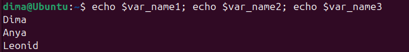

* Створення псевдонімів для відображення календарів за допомогою команди `cal` та їх тестування:
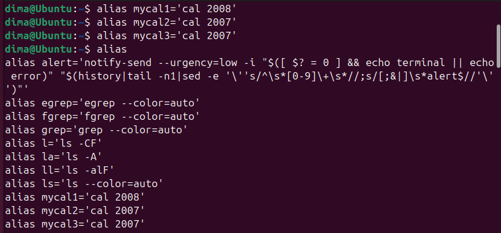

**2.2. Робота з функціями (Functions) в терміналі:**

* Створення та виклик функції `students_report` для форматованого виводу даних:

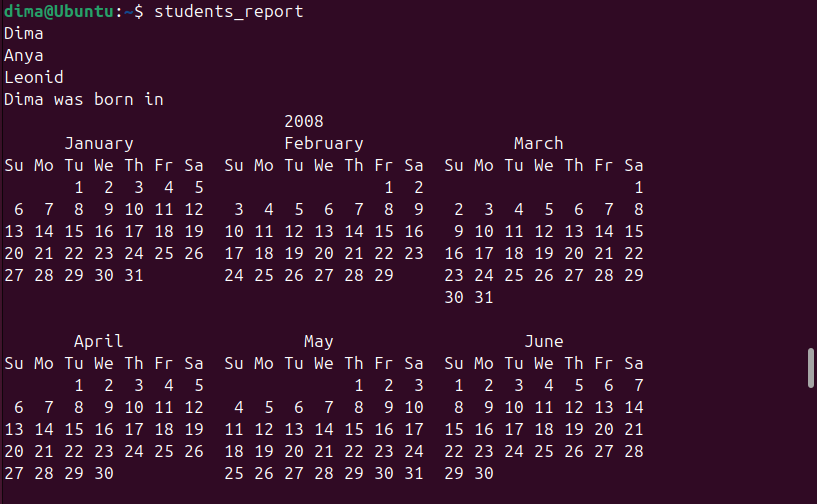
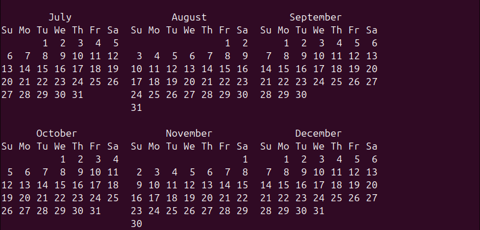
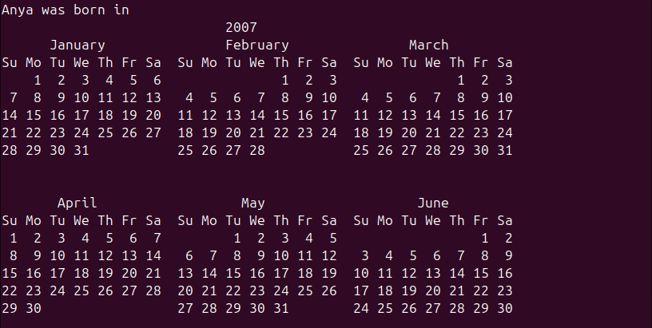
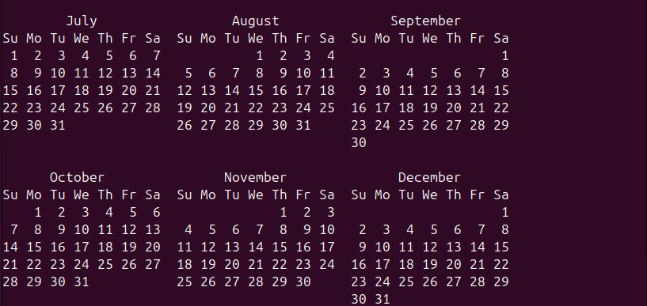
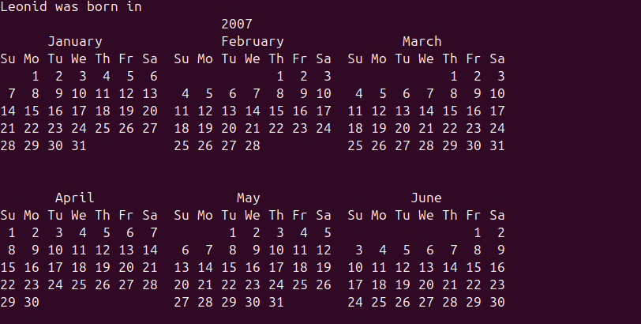
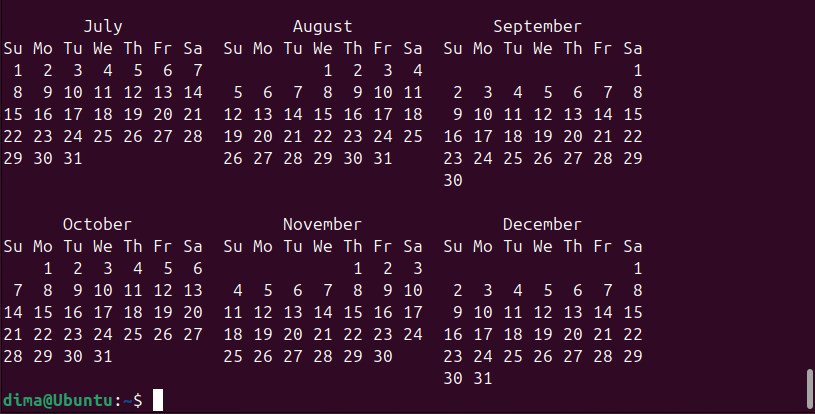

**2.3. Робота з лапками (Quoting) в терміналі. Виведіть в командному рядку наступні речення:**

* Демонстрація комбінування тексту та значень змінних:
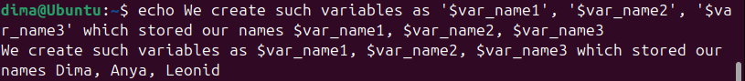

* Демонстрація екранування спецсимволів та виклику псевдонімів:

**2.4. Робота з інструкціями керування (Control Statements):**

* **Чи можна завдання 2.1 та 2.2 виконати через інструкції керування без окремої функції?**  
Так, замість функції можна використати інструкції керування потоком.
1. За допомогою оператора послідовного виконання (`;`):
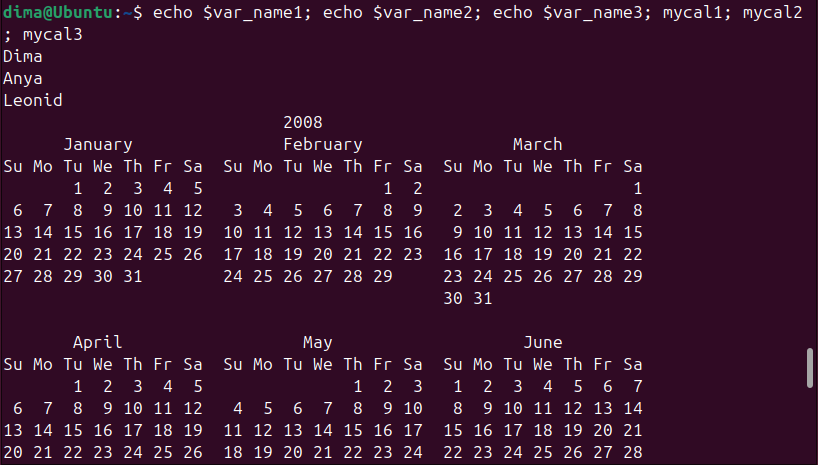

2. За допомогою логічного оператора AND (`&&`):
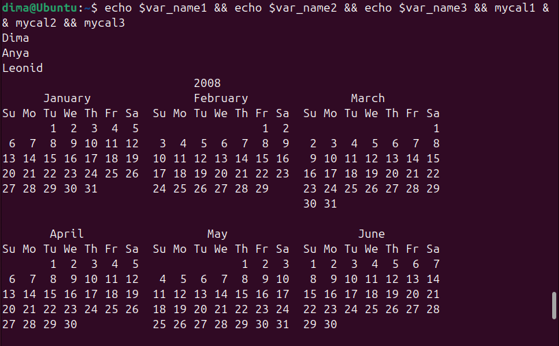

3. Форматування виводу через `echo -e`:
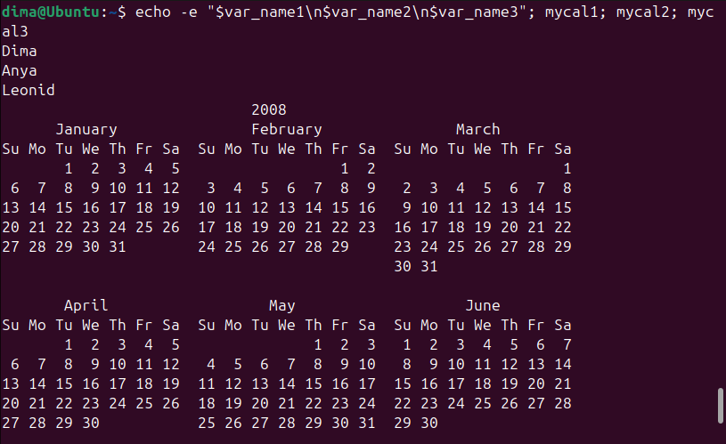

**2.5. Робота з командами довідки (Man Pages) в терміналі:**

* Отримання базової довідки по команді `uname`:  

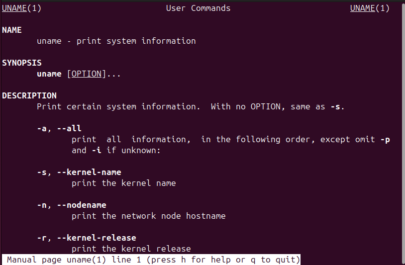

* П'ять практичних варіантів використання ключів команди `uname`:
1. `uname -a` (Уся доступна інформація):  
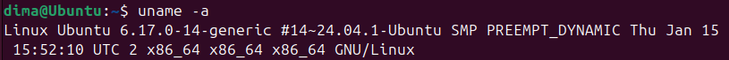
2. `uname -s` (Тільки ім'я ядра):  
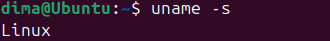
3. `uname -n` (Мережеве ім'я):  
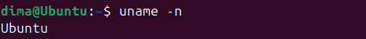
4. `uname -r` (Реліз ядра):  
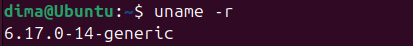
5. `uname -m` (Апаратна архітектура):  
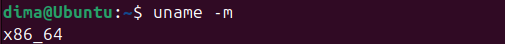

---

### Контрольні запитання

**1. Які типи команд існують в оболонці Bash?**
В оболонці існують 4 основні типи інструкцій:
1. *Псевдоніми (Aliases)* — користувацькі скорочення команд.
2. *Функції (Functions)* — набори команд, об'єднані під одним іменем, що зберігаються в пам'яті оболонки.
3. *Вбудовані команди (Built-ins)* — функції, які є невіддільною частиною самої оболонки Bash (наприклад, `cd`, `echo`, `pwd`).
4. *Зовнішні команди (Executables)* — окремі бінарні файли програм, що лежать на диску (зазвичай у `/bin` чи `/usr/bin`).
Перевірити тип можна командою `type`.

**2. Що таке змінні оточення? Які вони бувають. Як їх можна переглянути в терміналі?**
Змінні оточення — це глобальні налаштування системи у вигляді пар "Ключ=Значення", які зчитуються різними програмами для правильної роботи (наприклад, мова системи, шлях до домашньої папки). Вони поділяються на системні (визначені ОС) та користувацькі (створені вами). Переглянути їх повний список можна за допомогою команд `env` або `printenv`.

**3. Опишіть змінну $PS1. Як в терміналі переглянути її вміст?**
Змінна `$PS1` визначає формат та вигляд основного рядка запрошення, який ви бачите кожного разу перед введенням команди. Вона містить спеціальні escape-послідовності (наприклад, `\u` для юзера, `\w` для поточної папки). Подивитися її поточний формат можна простою командою: `echo $PS1`.

**4. Як можна змінити значення змінної $PS1? Що при цьому відбудеться в рядку запрошенні в bash. Як змінити значення цієї змінної не на поточний сеанс, а за замовчуванням?**
Змінити її можна звичайним присвоєнням: `PS1="[MyPrompt]$ "`. Після натискання Enter рядок запрошення одразу змінить свій вигляд на новий. Проте, при закритті термінала ці зміни зникнуть. Щоб застосувати їх назавжди (за замовчуванням), потрібно додати рядок `export PS1="[MyPrompt]$ "` у конфігураційний файл `~/.bashrc` вашого користувача.

**5. Для чого використовують лапки в оболонці Bash?**
Лапки дозволяють контролювати, як оболонка обробляє текст:
* Одинарні лапки (`' '`) сприймають весь текст всередині буквально, ігноруючи будь-які спецсимволи та змінні.
* Подвійні лапки (`" "`) дозволяють обробляти змінні (наприклад, `$USER`), але сприймають пробіли як частину тексту, а не як розділювачі аргументів.
* Зворотні лапки (`` ` ` ``) або синтаксис `$()` виконують команду всередині і підставляють її результат у рядок.

**6. Для чого використовують інструкції керування, які їх види Ви знаєте?**
Вони застосовуються для керування черговістю та умовами запуску кількох команд.
* `;` — безумовне послідовне виконання команд одна за одною.
* `&&` (Логічне І) — друга команда запуститься, тільки якщо перша відпрацювала без помилок.
* `||` (Логічне АБО) — друга команда запуститься, тільки якщо перша завершилась з помилкою.

**7. В чому різниця якщо в кінці рядку запрошення bash стоїть символ $ чи #?**
Це індикатор привілеїв:
* Символ `$` (наприклад, `[user@host ~]$`) означає стандартні права доступу. Користувач не може змінювати системні налаштування без використання `sudo`.
* Символ `#` (наприклад, `[root@host ~]#`) означає, що ви працюєте від імені суперкористувача (root). Ви маєте повний, необмежений контроль над системою.

**8. Яке призначення команд whereis та locate? Яка між ними відмінність?**
Обидві команди використовуються для пошуку. Відмінність полягає в механізмі:
* `whereis` шукає виключно виконувані файли програм, їх сирцеві коди та довідку (`man`) у строго визначених системних директоріях.
* `locate` шукає будь-які файли за назвою по всьому жорсткому диску. Вона працює миттєво, оскільки звертається до попередньо проіндексованої бази даних, але може не знайти файли, створені кілька хвилин тому (поки база не оновиться).

## Conclusions

Під час виконання цієї лабораторної роботи я здобув стійкі практичні навички роботи з інтерфейсом командного рядка (CLI) у середовищі Linux. Я детально вивчив механізми взаємодії з командною оболонкою Bash, зокрема навчився оперувати локальними та глобальними змінними, створювати псевдоніми (aliases) для пришвидшення роботи та використовувати різні типи лапок для керування обробкою текстових даних.

Окрім цього, я розширив свої знання щодо автоматизації процесів за допомогою інструкцій керування (логічних операторів `&&`, `||` та послідовного виконання `;`), а також опанував інструменти пошуку та роботи з офіційною вбудованою документацією (`man`, `info`, `help`). Здобуті навички є фундаментом для ефективного системного адміністрування та створення bash-скриптів у майбутньому.
