# Лабораторна робота №4
## Дисципліна: Операційні системи
## Тема: “Команди Linux для управління процесами”
### Виконав: студент групи РПЗ-33, Лоботенко Дмитро

---

### Мета роботи:
1. Отримання практичних навиків роботи з командною оболонкою Bash.
2. Знайомство з базовими командами для управління процесами.

### Матеріальне забезпечення занять:
1. ЕОМ типу IBM PC.
2. ОС сімейства Windows та віртуальна машина Virtual Box (Oracle).
3. ОС GNU/Linux (будь-який дистрибутив).
4. Сайт мережевої академії Cisco netacad.com та його онлайн курси по Linux.

---

### Завдання для попередньої підготовки.

#### 1. Прочитайте короткі теоретичні відомості до лабораторної роботи та зробіть невеличкий словник базових англійських термінів з питань призначення команд та їх параметрів.

_Словник базових англійських термінів_

| № | Слово | Пояснення |
| :--- | :--- | :--- |
| 1 | **Process** | Процес — активна програма, яка в даний момент завантажена в оперативну пам'ять та обробляється центральним процесором. |
| 2 | **PID (Process ID)** | PID (Ідентифікатор процесу) — спеціальний числовий код, який операційна система видає кожному новому завданню для його унікальної ідентифікації. |
| 3 | **Background** | Робота у фоні — режим виконання задачі, при якому програма працює непомітно для користувача, залишаючи командний рядок вільним для інших дій. |
| 4 | **Foreground** | Активний режим (передній план) — стандартний спосіб запуску програми, при якому вона повністю займає термінал і вимагає свого завершення для введення наступних команд. |
| 5 | **Real-time monitoring** | Динамічний моніторинг — процес безперервного спостереження за станом системи та споживанням ресурсів, інформація про які оновлюється автоматично (як у `top`). |
| 6 | **Signal** | Системний сигнал — метод програмної взаємодії, за допомогою якого ядро або сам користувач може змусити процес завершитися, призупинитися чи перезапуститися. |
| 7 | **Daemon** | Демон — системна програма або служба, яка працює у фоновому режимі (зазвичай від моменту запуску ОС) і не вимагає прямої взаємодії з користувачем. |
| 8 | **Job Control** | Керування завданнями — вбудована можливість командної оболонки, що дозволяє користувачеві призупиняти процеси та перемикати їх між фоном і активним екраном. |
| 9 | **Parent Process** | Батьківський процес — програма, яка ініціювала запуск одного або кількох інших процесів за допомогою системного виклику в ядрі. |
| 10 | **Zombie Process** | Зомбі-процес — стан програми, яка вже завершила своє виконання, але запис про неї все ще тимчасово зберігається в системній таблиці процесів. |

#### 2. На базі розглянутого матеріалу дайте відповіді на наступні питання:

**2.1. Які команди для моніторингу стану процесів ви знаєте. Як переглянути їх можливі параметри?**  
Для спостереження за процесами застосовують утиліти `ps` (для виводу статичного списку), `top` (базовий динамічний монітор) та `htop` (більш інтерактивний і візуально зрозумілий аналог). Ознайомитися з доступними ключами можна через сторінки офіційного посібника (наприклад, `man ps`) або викликавши коротку довідку за допомогою параметру `--help`.

**2.2. Чи може команда ps у реальному часі відслідковувати стан процесів?**  
Ні, команда `ps` виводить лише статичний зріз даних. Вона фіксує стан процесів рівно в ту секунду, коли була виконана. Для безперервного спостереження, що оновлюється автоматично, слід використовувати утиліту `top`.

**2.3. За якими параметрами можливе сортування процесів в команді top? Як переключатись між ними?**  
В утиліті `top` передбачено сортування за відсотком використання ЦП (`%CPU`), обсягом зайнятої оперативної пам'яті (`%MEM`), часом активності (`TIME+`) та числовим ідентифікатором (`PID`). В інтерактивному режимі критерій сортування змінюється гарячими клавішами:
* `P` — за навантаженням на процесор.
* `M` — за споживанням пам'яті.
* `T` — за часом виконання.
* `N` — за номером PID.

**2.4. Які команди для завершення роботи процесів ви знаєте?**  
Щоб примусово зупинити процес, застосовують:
* `kill [PID]` — відправляє системний сигнал (зазвичай `SIGTERM`) конкретному процесу за його номером.
* `killall [ім'я]` — завершує всі екземпляри програм з вказаним іменем одночасно.
* `pkill` — шукає та закриває процеси за певним шаблоном у назві або іншими атрибутами.
* `xkill` — інструмент для графічних оболонок, що дозволяє закрити завислу програму кліком миші по її вікну.

#### 3. Прочитати матеріал про роботу з процесами у терміналі:
* Процеси в Linux. Управління процесами
* Find out what processes are running in the background on Linux

---

## Хід роботи

#### 1. Початкова робота в CLI-режимі в ОС сімейства Linux:

**1.1 – 1.3. Запуск операційної системи та термінала.**  
Для виконання цієї лабораторної роботи використовується віртуальна машина Ubuntu_PC з академії notecad.
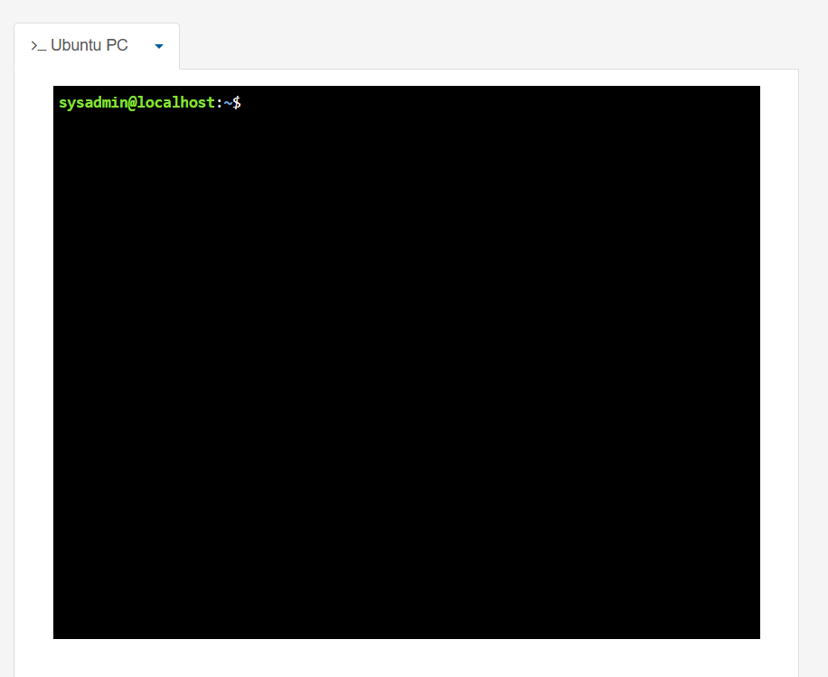

#### 2. Дайте відповіді на наступні питання:

* **Як вивести вміст директорії /proc? Де вона знаходиться та для чого призначена? Охарактеризуйте інформацію про її вміст?**  
Вміст каталогу `/proc` переглядається стандартною командою `ls /proc`. Це не звичайна тека на диску, а віртуальна файлова система (`procfs`), яка генерується ядром "на льоту" в оперативній пам'яті. Вона містить директорії з номерами (які відповідають активним процесам за їх PID), а також спеціальні файли зі статистикою апаратного забезпечення (наприклад, інформація про ЦП у `cpuinfo` та пам'ять у `meminfo`).
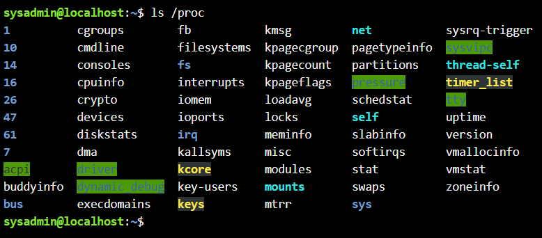

* **Як вивести інформацію про поточні сеанси користувачів. Якою командою це можна зробити?**  
Для аналізу активних сесій найінформативнішою є утиліта `w`. Вона показує не лише імена підключених користувачів та час логіну, а й поточні процеси, які вони виконують. Альтернативно можна використати команду `who` для отримання переліку підключених терміналів, або команду `users` для виведення самих лише логінів.
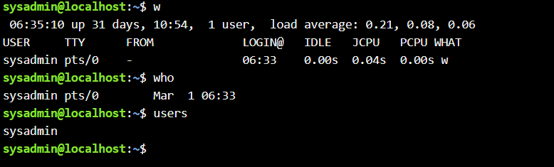

* **Які дії можна зробити в терміналі за допомогою комбінацій Ctrl + C, Ctrl + D та Ctrl + Z?**  
* `Ctrl + C` — генерує сигнал `SIGINT`, який миттєво перериває (зупиняє) виконання активної програми в терміналі.
* `Ctrl + D` — генерує символ кінця файлу (`EOF`). Часто використовується для завершення вводу або для швидкого закриття сеансу командної оболонки.
* `Ctrl + Z` — відправляє сигнал `SIGTSTP`, який тимчасово "заморожує" процес і переводить його у фоновий режим, повертаючи користувачеві доступ до консолі.

* **Чим відрізняється фоновий процес від звичайного. Де вони використовуються?**  
Звичайний процес (foreground) захоплює контроль над терміналом, блокуючи можливість введення нових команд до свого повного завершення. Фоновий процес (background) працює асинхронно, паралельно з оболонкою, віддаючи консоль користувачеві. Фонові процеси ідеально підходять для тривалих завдань (компіляція коду, архівація, сканування мережі), щоб не переривати основний робочий процес.

* **Опишіть наступні команди та поясніть що вони виконують – команда jobs, bg, fg.**  
* `jobs` — відображає список усіх зупинених або фонових завдань, що прив'язані до поточного термінала.
* `bg` (background) — дає команду раніше зупиненому (за допомогою Ctrl+Z) завданню продовжити свою роботу, але вже непомітно у фоні.
* `fg` (foreground) — витягує фонове або зупинене завдання назад на передній план, повертаючи йому контроль над консоллю.

* **Якою командою можна переглянути інформацію про запущені в системи фонові процеси та задачі?**  
Перевірити власні фонові завдання поточного сеансу можна утилітою `jobs`. Щоб побачити абсолютно всі системні процеси, що працюють у фоні (так звані демони), необхідно скористатися розширеним виводом `ps aux` або запустити диспетчер `top`.

* **Як призупинити фоновий процес, як його потім відновити та при необхідності перезапустити?**  
Активний процес призупиняється комбінацією `Ctrl + Z`. Щоб відновити його роботу без блокування термінала, вводимо команду `bg`, а для повернення на екран — `fg`. Якщо програму потрібно перезапустити з новими параметрами, її необхідно остаточно завершити (сигналом `kill` або `Ctrl+C`) і виконати стартову команду заново.

#### 3. Запустіть термінал, та в командному рядку виконайте наступні дії:

* **запустіть команду top, проаналізуйте отриманий в цій команді результат та охарактеризуйте найбільш активні процеси у системі;**  
Після запуску `top` у верхньому блоці відображається системний час (uptime), кількість користувачів та статистика завдань. Далі йдуть рядки навантаження на процесор (де `id` — це відсоток простою) і статистика оперативної пам'яті (MiB Mem та Swap). 
У самій таблиці видно найактивніші процеси. Її основні колонки:
* `PID` — унікальний ідентифікатор.
* `USER` — від імені кого запущено процес.
* `%CPU` — відсоток навантаження на обчислювальні ядра.
* `%MEM` — частка використаної оперативної пам'яті.
* `COMMAND` — системна назва процесу (наприклад, `bash`, `gnome-shell`, `top`).
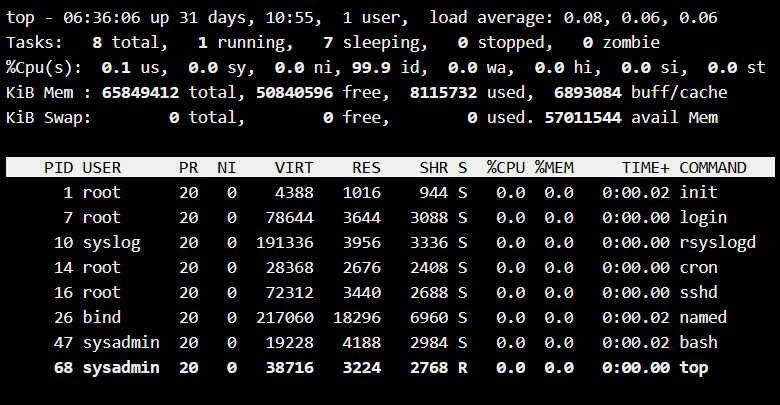

* **призупинити виконання команди top (треба використати комбінацію клавіш);**  
Натискання `Ctrl + Z` під час роботи утиліти зупиняє її. У терміналі з'являється системне повідомлення `[1]+ Stopped top`, що свідчить про перехід програми в стан очікування.
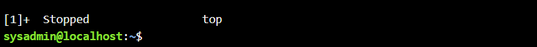

* **вивести інформацію про процеси за допомогою команди ps;**  
Базовий виклик команди `ps` без параметрів показує лише ті процеси, які пов'язані з поточним екземпляром термінала (це оболонка `bash` та щойно введена утиліта `ps`).  
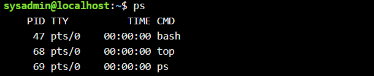  

* **наведіть 5 прикладів з використанням різних параметрів команди ps. Опишіть, що саме роблять обрані Вами параметри.**  
1. `ps -e` — відображає всі запущені процеси в системі, включаючи системні демони.
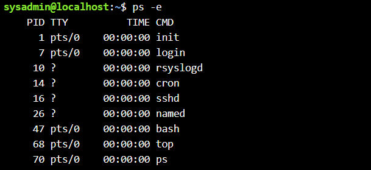
2. `ps -u [користувач]` — фільтрує загальний список, залишаючи лише ті програми, що належать конкретному користувачу.
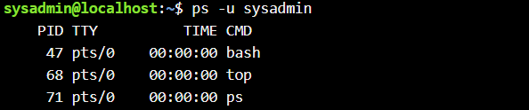
3. `ps -f` — генерує звіт у повному форматі (Full-format), додаючи колонки ідентифікатора батьківського процесу (`PPID`) та часу запуску.  
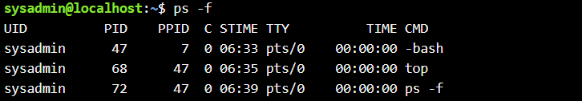
4. `ps --forest` — малює ієрархію процесів за допомогою ASCII-графіки, візуалізуючи зв'язки типу "батько-нащадок".  
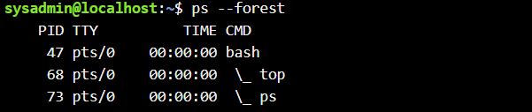
5. `ps -p [PID]` — виводить вичерпну інформацію виключно про один процес за його точним номером.
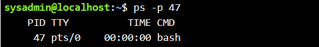

* **передивіться чи є у Вас запущені фонові процеси, які саме?**   
Викликавши команду `jobs`, можна побачити всі зупинені або фонові завдання. Наразі в переліку знаходиться рядок `[1]+ Stopped top` — це наш призупинений системний монітор.   
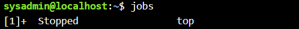

* **відновити виконання призупиненого фонового процесу спочатку у позиції “на передньому плані” (foreground), потім ще раз його призупинити, а потім відновити його виконання у позиції “на задньому плані” (background).**  
Командою `fg` повертаємо `top` на передній план (він розгорнеться на весь екран).

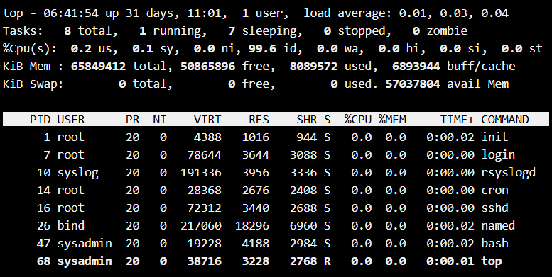  
Знову зупиняємо його через `Ctrl + Z`. Після цього вводимо команду `bg` для переведення у фоновий режим. Оскільки `top` є інтерактивною програмою, якій потрібен вивід на екран, вона залишиться у статусі "Stopped" у фоні, проте інші неінтерактивні скрипти продовжили б свою роботу.   
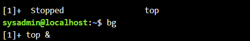

* **завершити роботу даного фонового процесу.**  
Для завершення завдання використовуємо команду `kill %1` (де 1 — номер завдання зі списку jobs). Повторний виклик `jobs` покаже, що процес перейшов у статус `Terminated` або `Done`.
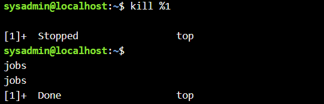

---

### Контрольні запитання:

**1. Яке призначення директорії /proc в системах Linux. Яку інформацію вона зберігає?**  
Директорія `/proc` слугує віртуальним інтерфейсом до ядра операційної системи. Вона не містить постійних файлів, а генерується динамічно. `/proc` зберігає вичерпну інформацію про поточний стан "заліза" (навантаження процесора, обсяги пам'яті, системні переривання), а також має окремі підкаталоги для кожного активного `PID`, де знаходяться детальні параметри та статистика конкретного процесу.

**2. Як серед будь-яких трьох процесів динамічно визначати, який з них в поточний момент часу використовує найбільший обсяг пам'яті? Який відсоток пам’яті він споживає від загального обсягу?**  
Для цього слід запустити утиліту `top` і застосувати сортування за використаною оперативною пам'яттю, натиснувши комбінацію `Shift + M` (або просто `M`). Найбільш ресурсномісткий процес переміститься на перший рядок таблиці, а в колонці `%MEM` буде вказано точний відсоток оперативної пам'яті, який він займає відносно загального доступного обсягу системи.

**3. Як отримати ієрархію батьківських процесів в системах Linux? Наведіть її структуру та охарактеризуйте.**  
Для візуалізації дерева взаємозв'язків процесів використовується команда `pstree`. Структура має вигляд розгалуженого дерева, оскільки кожен новий процес (Child) породжується вже наявним (Parent) через системний виклик `fork()`. На самій вершині цієї ієрархії стоїть процес ініціалізації (`systemd` або `init` з PID 1), який першим завантажується ядром і запускає всі інші системні служби.
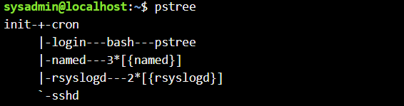

**4. Чим відрізняється команда top від ps?**  
Утиліта `ps` робить миттєвий текстовий знімок (snapshot) стану процесів на ту мілісекунду, коли була запущена команда. `top`, натомість, є повноцінною програмою-монітором, яка "висітиме" на екрані і динамічно оновлюватиме статистичні дані кожні кілька секунд, що робить її незамінною для відстеження пікових навантажень.

**5. Які додаткові можливості реалізує htop в порівнянні з top?**  
`htop` пропонує покращений кольоровий інтерфейс з наочними графічними шкалами (барами) навантаження на кожне обчислювальне ядро та споживання пам'яті. Утиліта дозволяє прокручувати великі списки процесів за допомогою миші або стрілок як по вертикалі, так і по горизонталі. Окрім того, `htop` має зручне меню внизу екрана, яке дозволяє відправляти сигнали (F9 - Kill) або змінювати пріоритети (F7/F8 - Nice) без необхідності запам'ятовувати PID процесу.

**6. Опишіть компоненти вашої мобільної ОС для здійснення моніторингу запущених в системі процесів?**  
У мобільних ОС (наприклад, Android) моніторинг здійснюється через системні налаштування. Компонент «Служби, що працюють» (Running Services) у меню розробника відображає активні фонові процеси та розподіл оперативної пам'яті. Для аналізу енергоспоживання використовується штатна вкладка «Батарея», яка показує, який відсоток заряду спожив кожен запущений додаток або системна служба.

**7. Чи підтримує Ваша мобільна ОС термінальне керування роботою процесів, опишіть як саме.**  
За замовчуванням Android приховує доступ до консолі. Проте, архітектура системи базується на ядрі Linux, тому встановивши емулятор термінала (наприклад, додаток Termux), користувач отримує доступ до середовища CLI. У ньому можна виконувати стандартні команди керування: переглядати завантаження через `top` і завершувати процеси через `kill`, хоча для впливу на критичні системні служби будуть потрібні root-права.

**8. Чи можливо поставити сторонні програмні засоби, що дозволяють організувати управління та моніторинг роботою процесів у Вашому мобільному телефоні. Коротко опишіть їх.**  
Так, для глибшого моніторингу існують потужні сторонні додатки, такі як CPU-Z, DevCheck або 3C All-in-One Toolbox. Ці програми дозволяють у зручному графічному вигляді аналізувати частоти кожного ядра процесора, відстежувати температурні датчики, контролювати завантаження графічного прискорювача та (за наявності root-доступу) гнучко керувати автозавантаженням і примусово "вбивати" ресурсомісткі фонові процеси.

## Conclusions:

During this laboratory work, I acquired hands-on skills in managing Linux processes via the Bash command-line interface. I explored the fundamental differences between foreground and background execution and learned how to manipulate task states using keyboard shortcuts (such as Ctrl+Z and Ctrl+C) and shell built-ins (`jobs`, `fg`, `bg`). 

Furthermore, I utilized process monitoring utilities, recognizing the distinction between the static snapshots provided by `ps` and the real-time observation capabilities of `top` and `htop`. I also analyzed the structure of the `/proc` virtual filesystem, which exposes kernel data, and practiced sending termination signals to unresponsive tasks. These practical skills are essential for efficient system administration, resource optimization, and software troubleshooting in Unix-like environments.
