# Лабораторна робота №5
## Дисципліна: Операційні системи
### Тема: Навігація файловою системою та керування файлами і каталогами

> **Виконав:** студент групи РПЗ-33, Лобатенко Дмитро

---

## Мета роботи

1. Набуття практичних навичок роботи з командною оболонкою Bash.
2. Вивчення базових команд навігації по файловій системі Linux.
3. Вивчення базових команд для керування файлами та каталогами.

---

## Матеріальне забезпечення занять

1. ЕОМ типу IBM PC.
2. ОС сімейства Windows та віртуальна машина VirtualBox (Oracle).
3. ОС GNU/Linux (будь-який дистрибутив).
4. Онлайн-ресурси мережевої академії Cisco — netacad.com.

---

## Завдання для попередньої підготовки

### 1. Словник базових англійських термінів

| № | Термін | Пояснення |
|---|--------|-----------|
| 1 | Filesystem | Файлова система — ієрархічна структура для організації та зберігання файлів у Linux |
| 2 | Directory | Каталог (директорія) — спеціальний тип файлу для зберігання інших файлів; аналог папки у Windows |
| 3 | Root directory | Кореневий каталог — вершина дерева файлової системи, позначається символом `/` |
| 4 | Home directory | Домашній каталог — персональна директорія користувача, з якої розпочинається сеанс у терміналі |
| 5 | Source | Джерело — файл або каталог, що є вихідним об'єктом при копіюванні чи переміщенні |
| 6 | Destination | Призначення — цільове місце розташування або нове ім'я файлу/каталогу |
| 7 | Glob characters | Символи підстановки (`*`, `?`) — спецсимволи оболонки для задання шаблонів при пошуку файлів |
| 8 | Recursive | Рекурсивний — опція (`-r`), що розповсюджує дію команди на весь вміст каталогу включно з вкладеними файлами |
| 9 | Interactive | Інтерактивний — режим (`-i`), при якому система запитує підтвердження перед виконанням потенційно небезпечної операції |
| 10 | No Clobber | Без перезапису (`-n`) — заборона перезаписування вже наявного файлу призначення |
| 11 | Verbose | Докладний режим (`-v`) — вивід повідомлень про результат виконання кожного кроку команди |
| 12 | Overwrite | Перезапис — повна заміна вмісту існуючого файлу вмістом вихідного |

---

### 2.1. Порівняння файлових структур Windows і Linux

| Характеристика | Windows | Linux |
|----------------|---------|-------|
| Кореневий каталог та ієрархія | Ґрунтується на логічних дисках із власними літерами (`C:\`, `D:\`). Кожен диск має незалежну ієрархію | Єдине глобальне дерево каталогів. Усе починається з `/`; будь-який носій монтується як піддиректорія (`/mnt`, `/media` тощо) |
| Роздільник шляху | Зворотний слеш: `C:\Users\Name\file.txt` | Прямий слеш: `/home/name/file.txt` |
| Регістрозалежність | Нечутлива: `Report.txt` і `report.txt` — один файл | Чутлива: `File.txt`, `file.txt` та `FILE.TXT` — три різних файли |
| Роль розширень | Визначальна — розширення вказує тип файлу та асоційовану програму | Необов'язкова — тип і права виконання визначаються вмістом файлу, а не розширенням |

---

### 2.2. Стандарт FHS

**FHS (Filesystem Hierarchy Standard)** — стандарт, що регламентує структуру каталогів і їхнє призначення в Unix-подібних операційних системах.

Завдяки FHS будь-який дистрибутив Linux (Ubuntu, Fedora, Debian, Arch тощо) зберігає єдину передбачувану структуру директорій, що спрощує роботу системних адміністраторів та розробників. Ключові каталоги згідно зі стандартом:

| Каталог | Призначення |
|---------|-------------|
| `/bin`  | Основні утиліти, доступні всім користувачам (`ls`, `cp` тощо) |
| `/etc`  | Конфігураційні файли системи |
| `/home` | Домашні каталоги звичайних користувачів |
| `/var`  | Мінливі дані: журнали, бази даних |
| `/tmp`  | Тимчасові файли, що видаляються після перезавантаження |

---

### 2.3. Основні команди для роботи з файлами і каталогами

**Створення:**
- `touch [файл]` — створення порожнього файлу (або оновлення мітки часу)
- `mkdir [каталог]` — створення нової директорії

**Переміщення та перейменування:**
- `mv [джерело] [призначення]` — переміщує або перейменовує файл/каталог

**Копіювання:**
- `cp [джерело] [призначення]` — копіює файл
- `cp -r [джерело] [призначення]` — рекурсивне копіювання каталогу з усім вмістом

**Видалення:**
- `rm [файл]` — безповоротне видалення файлу
- `rmdir [каталог]` — видалення порожнього каталогу
- `rm -r [каталог]` — рекурсивне видалення каталогу з усім вмістом

---

## Хід роботи

### 1. Запуск операційної системи

Під час виконання лабораторної роботи використовувалась віртуальна машина Ubuntu_PC.

---

### 2. Таблиця команд з Lab 7 і Lab 8

| Команда | Призначення та функціональність |
|---------|--------------------------------|
| `pwd` | Виводить абсолютний шлях до поточного робочого каталогу (print working directory) |
| `cd Documents` | Переходить до вказаної директорії — у даному прикладі до `Documents` |
| `cd ~` | Повертає користувача до його домашнього каталогу |
| `echo ~ ~sysadmin ~root` | Демонструє розширення тильди для різних облікових записів системи |
| `echo *` | Відображає імена всіх файлів у поточному каталозі через розширення glob-символу `*` |
| `echo D*` / `echo P*` | Показує файли, що починаються з літери D або P відповідно |
| `echo *s` | Виводить файли, чиї імена закінчуються на літеру `s` |
| `echo D*n*s` | Демонструє можливість використання зірочки кілька разів або в середині шаблону |
| `echo ??????` | Відображає файли, чиї імена складаються рівно з шести символів |
| `echo D????????` | Виводить файли, що починаються з `D` і мають загальну довжину рівно 9 символів |
| `echo ?????*s` | Комбінація підстановок: імена щонайменше з 6 символів, що завершуються на `s` |
| `echo [DP]*` / `echo [!DP]*` | Перший приклад — файли з D або P на початку; другий — усі інші |
| `echo [D-P]*` / `echo [!D-P]*` | Файли, що починаються із символу з діапазону D–P, або навпаки |
| `cd ..` | Перехід на один рівень угору до батьківської директорії |
| `cd ../dict` | Перехід угору, а потім у підкаталог `dict` — через відносний шлях |
| `ls -a` | Показує всі файли, включно з прихованими (починаються з крапки) |
| `ls -l` | Розширений формат: тип, права, посилання, власник, група, розмір, дата зміни |
| `ls -R /etc/udev` | Рекурсивно виводить усі файли у вказаній директорії та всіх її підкаталогах |
| `ls -d` | Виводить тільки імена самих каталогів, не заходячи всередину них |
| `ls -d /etc/????` | Показує файли/каталоги в `/etc` з іменами рівно з чотирьох символів |
| `ls -d /etc/[abcd]*` | Відображає файли `/etc`, чиї імена починаються з `a`, `b`, `c` або `d` |
| `rm hosts` | Видаляє вказаний файл |
| `cp -v /etc/hosts hosts` | Копіює файл з виводом повідомлення про джерело та ціль завдяки ключу `-v` |
| `cp -p hosts /home/sysadmin` | Копіює файл зі збереженням його атрибутів (час, права) |
| `cp -R /etc/udev Myetc` | Рекурсивно копіює вміст каталогу `/etc/udev` у новий каталог `Myetc` |
| `mkdir Myetc` | Створює новий каталог з іменем `Myetc` |
| `rm -r Myetc` | Рекурсивно видаляє каталог `Myetc` разом з усім вмістом |
| `touch premove` | Створює порожній файл `premove` |
| `mv premove postmove` | Перейменовує файл `premove` на `postmove` |
| `rm postmove` | Видаляє файл після виконаного переміщення |

---

### 3. Практичні завдання в терміналі

#### Визначення поточного робочого каталогу

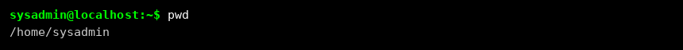

#### Перехід до кореневого каталогу та визначення місцезнаходження

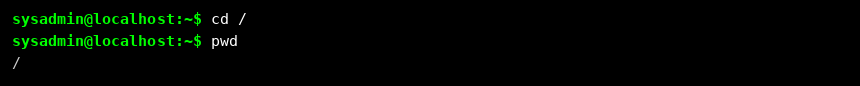

#### Перегляд вмісту поточного каталогу у довгому форматі

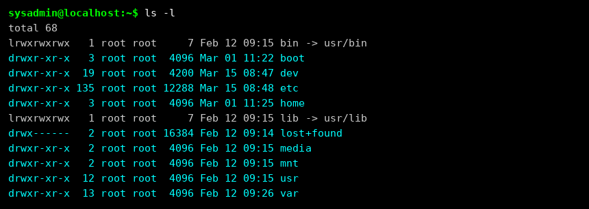

#### Перехід до /usr/share та визначення поточної директорії

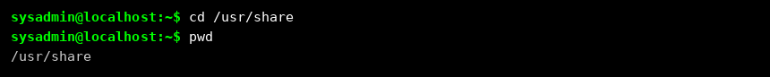

#### Перегляд вмісту з прихованими файлами

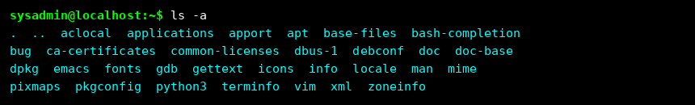

#### Перехід до /etc

#### Файли /etc, що починаються з літери «d» (ім'я Дмитро)

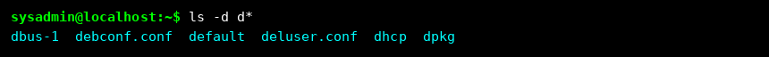

#### Файли /etc з іменами рівно з 6 символів

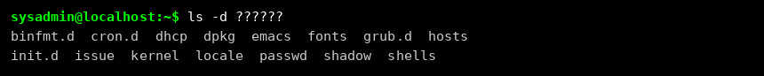

#### Файли /etc, що закінчуються на літеру «d»

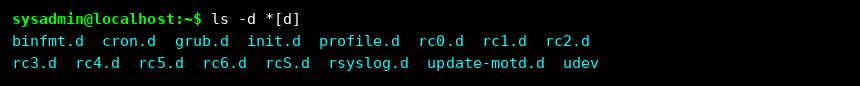

#### Домашній каталог — вміст у зворотному алфавітному порядку через конвеєр

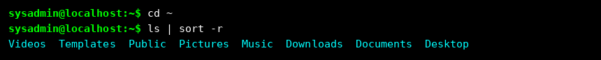

#### Створення директорії з назвою групи

#### Перегляд домашнього каталогу з ключем -r

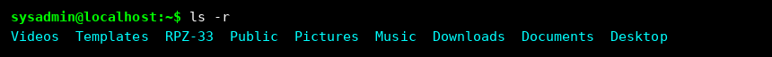

> Ключ `-r` виводить список файлів і каталогів у зворотному алфавітному порядку (від Z до A).

#### Перехід у директорію RPZ-33 та створення файлу lab5

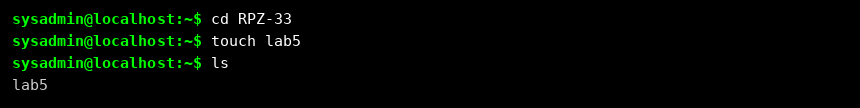

#### Створення трьох підкаталогів з прізвищами студентів (одна команда)

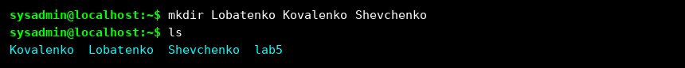

#### Перехід у перший підкаталог та створення файлу з іменем студента

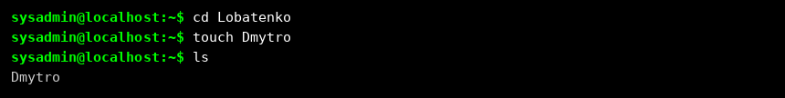

#### Запис інформації у файл командою echo

#### Перегляд вмісту файлу Dmytro

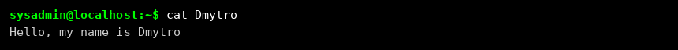

#### Копіювання Dmytro → Oleksiy та перегляд каталогу

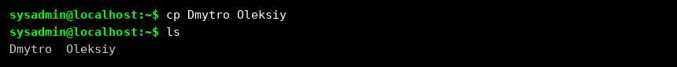

#### Перегляд скопійованого файлу (містить дані першого студента)

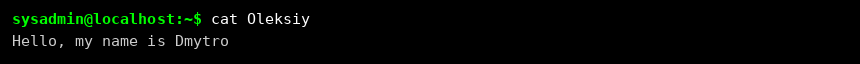

#### Оновлення вмісту файлу Oleksiy та перевірка

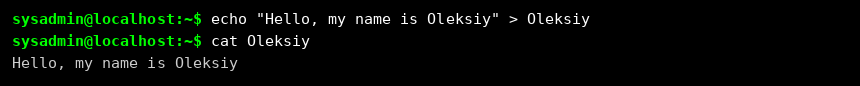

#### Переміщення файлу Oleksiy у директорію Kovalenko

#### Копіювання Dmytro → Andriy та переміщення у Shevchenko

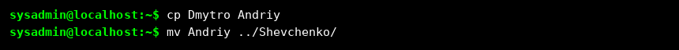

#### Перехід у директорію Shevchenko, перевірка та оновлення файлу Andriy

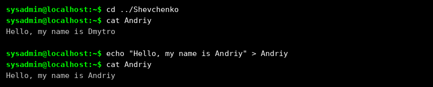

#### Повернення до домашнього каталогу

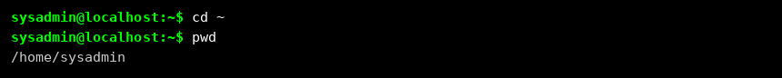

#### Рекурсивний перегляд вмісту каталогу RPZ-33 з кольоровим виводом

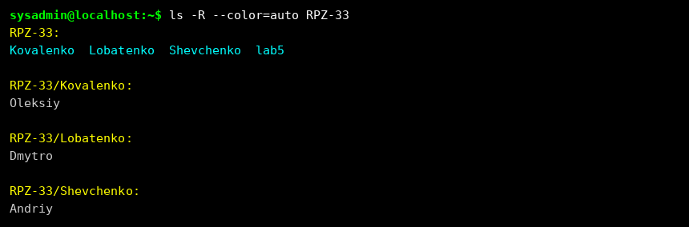

---

### 4. Опис команд навігації по файловій системі

| Команда | Дія |
|---------|-----|
| `cd /` | Перехід безпосередньо до кореневого каталогу — вершини дерева файлової системи |
| `cd /home` | Абсолютний перехід до каталогу `/home`, де розміщені персональні директорії всіх звичайних користувачів |
| `cd ~` | Переміщення до домашнього каталогу поточного користувача; тильда автоматично розгортається в повний шлях |
| `cd` | Рівнозначний команді `cd ~`; повертає до домашнього каталогу за замовчуванням |
| `cd ..` | Перехід на один рівень угору (батьківський каталог) відносно поточного місцезнаходження |
| `cd ../..` | Переміщення одразу на два рівні вгору по дереву каталогів |
| `cd -` | Повернення до попередньої директорії — функціонує як кнопка «Назад» |

---

## Контрольні запитання

### 1. Два способи відобразити шлях до домашнього каталогу командою echo

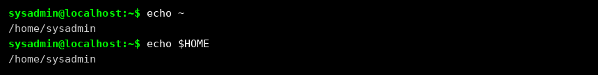

Перший спосіб використовує механізм розширення тильди оболонкою ще до виконання команди. Другий звертається до системної змінної середовища `$HOME`, яка зберігає абсолютний шлях до домашнього каталогу поточного користувача.

---

### 2. Перегляд вмісту кореневого каталогу без зміни поточної директорії

Так, перегляд можливий — команда `ls` приймає будь-який шлях як аргумент:

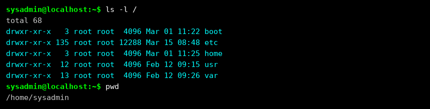

Поточний робочий каталог залишився незмінним — `/home/sysadmin`.

---

### 3. Додавання тексту до порожнього файлу в терміналі

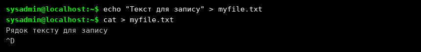

---

### 4. Копіювання та видалення каталогу — порожнього і непорожнього

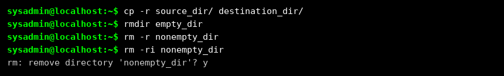

Команда `rmdir` спрацює лише для **порожньої** директорії — для непорожньої вона поверне помилку. У таких випадках необхідно використовувати `rm -r`.

---

### 5. Переміщення, перейменування або обидві дії одночасно?

`mv /work/tech/comp.png /Desktop`
➡️ **Тільки переміщення.** Файл переноситься в `/Desktop` зі збереженням оригінальної назви.

`mv /work/tech/comp.png /work/tech/my_car.png`
➡️ **Тільки перейменування.** Місцезнаходження не змінюється, змінюється лише ім'я файлу.

`mv /work/tech/comp.png /Desktop/computer.png`
➡️ **Переміщення та перейменування одночасно.** Файл переноситься в нову директорію й отримує нову назву.

---

## Висновки

У ході виконання лабораторної роботи було отримано практичний досвід роботи з командною оболонкою Bash в середовищі Linux. Опановано навігацію файловою системою за допомогою команд `pwd`, `cd` та `ls`, а також засвоєно різницю між абсолютними та відносними шляхами.

Крім того, відпрацьовано ключові операції управління файлами та директоріями: створення, копіювання, переміщення, перейменування та видалення об'єктів файлової системи з використанням команд `mkdir`, `touch`, `cp`, `mv` і `rm`. Вивчено застосування glob-символів для гнучкого пошуку файлів за шаблонами, а також перенаправлення виводу командою `echo` для запису даних безпосередньо у файл. Набуті навички формують міцну базу для впевненої роботи з Linux у режимі командного рядка без графічного інтерфейсу.
